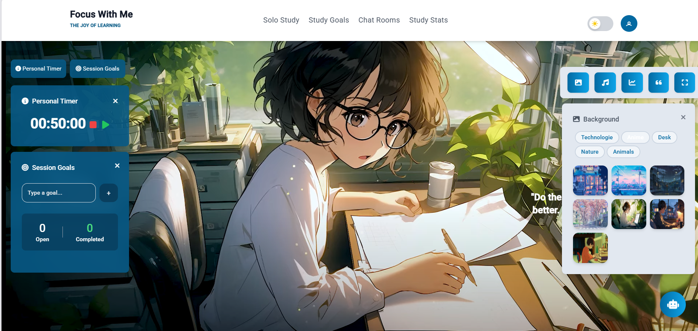
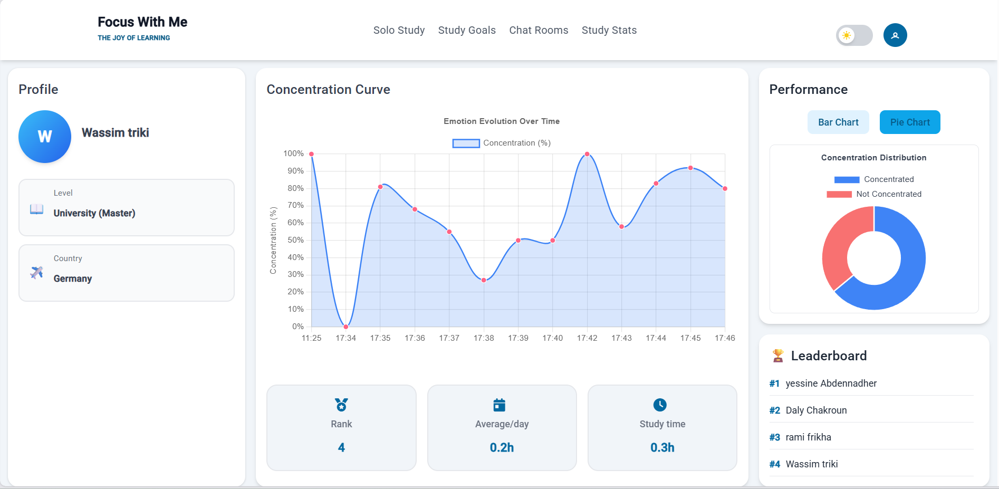

# 🎯 Focus With Me

> **Focus With Me** is a web application that helps students and professionals **improve their concentration** through **real-time intelligent analysis** and an **interactive dashboard**.

---

## 🚀 Project Overview

The application uses **computer vision** and **artificial intelligence** to **analyze users’ concentration levels** via the webcam.
It provides a **web dashboard** displaying clear statistics on focus evolution over time.

---

## ✨ Key Features

* 🔍 **Real-time Focus Analysis**

  * Detects behaviors related to loss of attention such as distractions or lack of focus.

* 📊 **Interactive Dashboard**

  * Displays charts and graphs showing concentration trends.

* 🤝 **Virtual Coworking**

  * Join a virtual workspace to focus alongside other users.

* 🤖 **Smart Assistant**

  * Offers personalized advice based on concentration data.

---

## 🖼️ Screenshots

| Home Page                     | Dashboard                               | Live Analysis                                               |
| ----------------------------- | --------------------------------------- | ----------------------------------------------------------- |
|  |  |  |

---

## 🎥 Video Demo

👉 [Watch the demonstration on YouTube](https://youtu.be/fUE1tAz2DtE)

---

## 🛠️ Technologies Used

* **Frontend**: Angular, TailwindCSS
* **Backend**: Python (FastAPI)
* **AI / Computer Vision**: PyTorch, OpenCV (focus level detection)
* **Database**: MongoDB
* **Others**: Chart.js / Recharts for data visualization

---

## ⚙️ Installation & Run

### Clone the project

```bash
git clone https://github.com/your-account/focus-with-me.git
cd focus-with-me
```

### Install and run the frontend

```bash
cd frontend
npm install
ng serve
```

### Install and run the backend

```bash
cd backend
pip install -r requirements.txt
uvicorn main:app --reload
```

---

## 📊 Future Improvements

* Gamification with points and badges.
* Calendar integration (Google Calendar, Outlook).
* Improved model accuracy for focus detection.
* Responsive mobile version.

---

## 👨‍💻 Author

Developed by **Mohamed Ali Chakroun**

* 📧 Email: [mohamedalichakroun.x@gmail.com](mailto:mohamedalichakroun.x@gmail.com)
* 💼 [LinkedIn] ([https://www.linkedin.com/in/mohamed-ali--chakroun](https://www.linkedin.com/feed/))


